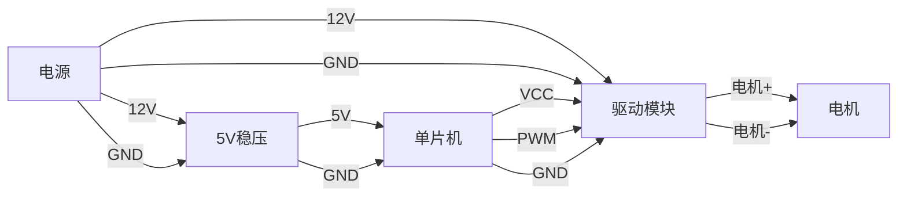

# 直流电机速度开环控制

## 相关IO介绍和控制原理

单片机通过控制电机驱动来实现直流电机的控制；由于单片机的电流太小，无法驱动电机，使用需要使用电机驱动模块来进行电机控制。现使用BTS7960电机控制模块来进行电机控制。

### 硬件连接流程

## 程序设计 

### PWM频率范围

PWM的输出首先要选择一个PWM频率；理由： 
* 1.高频避免电机啸叫
* 2.高频影响电机控制器
    * 内部MOSFET开关速度
    * 发热
    * 效率
    * 电流纹波
* 3.频率太低会导致
    * 电机转矩脉动大
    * 电流波动大
    * 电流纹波会增加发热
    * 低速控制不稳
---

### 调试出适合的 PWM 频率

#### 固定占空比

依次测试以下频率（占空比70%~100%）：

| **PWM频率** | **电机声音** | **电机振动** | **控制器温度** | **电流波动** |
|-----------|:---------:|:---------------:|:-------------:|:-------------:|
| 5 kHz     |  嗡  |  抖动  | 运行 2～5 分钟 | 万用表测电流稳定性 |
| 10 kHz    |  嗡  |  抖动  | 运行 2～5 分钟 | 万用表测电流稳定性 |
| 15 kHz    |  电磁啸叫  |  抖动  | 运行 2～5 分钟 | 万用表测电流稳定性 |
| 20 kHz    |  电磁啸叫  |  抖动  | 运行 2～5 分钟 | 万用表测电流稳定性 |
| 25 kHz    |  电磁啸叫  |  抖动  | 运行 2～5 分钟 | 万用表测电流稳定性 |
| 30 kHz    |  电磁啸叫  |  抖动  | 运行 2～5 分钟 | 万用表测电流稳定性 |

### 

### 结论
BTS7960 的推荐 PWM 频率范围：
* 最佳频率：15 kHz ～ 25 kHz
* 次优频率：5 kHz ～ 10 kHz
* 不建议：>30 kHz 

原因：H 桥驱动器内部 MOSFET 的开关损耗、热、开关死区等都会影响效率。
